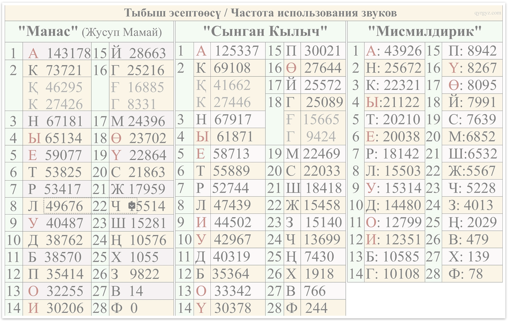

# Kyrgyz Text Analytics for Keyboard Layouts / Клавиатура жайгашуусу үчүн кыргызча текст аналитикасы

This repo contains corpus-based statistics and tooling to justify a Kyrgyz-first keyboard layout. It focuses on character frequencies, n-grams, and a data-backed layout rationale.

Бул репозиторий кыргыз тилине ыңгайлашкан клавиатура жайгашуусун негиздөө үчүн корпуска таянган статистиканы жана куралдарды камтыйт. Ал тамга жыштыгына, n-граммаларга жана маалыматка таянган жайгашуу негиздемесине басым жасайт.

## Stats and tools / Статистика жана куралдар

Stats files (TSV) / Статистика файлдары (TSV):
- `kyr_chars.tsv` (character frequencies, stopwords excluded / тамга жыштыгы, стоп-сөздөр алынып салынган)
- `kyr_bigrams.tsv` (bigram frequencies / биграмма жыштыктары)
- `kyr_trigrams.tsv` (trigram frequencies / триграмма жыштыктары)
- `raw_chars.tsv` (raw character frequencies, stopwords included / таза тамга жыштыгы, стоп-сөздөр менен)
- `raw_bigrams.tsv` (raw bigram frequencies / таза биграмма жыштыктары)
- `raw_trigrams.tsv` (raw trigram frequencies / таза триграмма жыштыктары)
- `word_freq.tsv` (word frequencies / сөз жыштыктары)
- [`combined_stats.tsv`](combined_stats.tsv) (comparison with literary sources / адабий булактар менен салыштыруу)

### Literary source comparison / Адабий булактар менен салыштыруу

The [`combined_stats.tsv`](combined_stats.tsv) file compares our corpus frequencies with three Kyrgyz literary works: *Manas*, *Syngan Kylych*, and *Mismildirik*. The "Corpus(raw)" column uses `raw_chars.tsv` which does not exclude stopwords—this provides a fairer comparison since the literary sources also include all words.

[`combined_stats.tsv`](combined_stats.tsv) файлы биздин корпустагы жыштыктарды үч кыргыз адабий чыгармасы менен салыштырат: "Манас", "Сынган Кылыч" жана "Мисмилдирик". "Corpus(raw)" тилкеси `raw_chars.tsv` файлын колдонот (стоп-сөздөр алынган эмес) — бул адабий булактар менен калыс салыштырууну камсыздайт, анткени аларда да бардык сөздөр камтылган.

Note: Literary sources originally showed phonemes with К/Қ and Г/Ғ as distinct. These have been merged (К+Қ→к, Г+Ғ→г) for comparison with our corpus which only uses к and г.

Эскертүү: Адабий булактарда башында К/Қ жана Г/Ғ фонемалары айырмаланып көрсөтүлгөн. Биздин корпус к жана г тамгаларын гана колдонгондуктан, салыштыруу үчүн алар бириктирилди (К+Қ→к, Г+Ғ→г).



Scripts / Скрипттер:
- `scripts/char_frequency_go.go` (characters + n-grams; optional TSV output / символдор + n-граммалар; кошумча TSV чыгаруу)
- `scripts/stopword_finder_go.go` (word frequency tool for stopword discovery / стоп-сөздөрдү табуу үчүн сөз жыштыгын эсептөөчү курал)

Stopwords / Стоп-сөздөр:
- `config/stopwords.txt` (one token per line / ар сапка бир токен)
Foreign words / Чет тилдеги сөздөр:
- `config/foreign_words.txt` (one token per line; excluded from stats / ар сапка бир токен; статистикадан чыгарылат)

## Text analytics (character + n-gram stats) / Текст аналитикасы (символ + n-грамма статистикасы)

The character tool lowercases text and removes tokens listed in a stopwords file (default: `config/stopwords.txt`, one token per line), then computes character, bigram, and trigram statistics. It can output full sorted TSV files for analysis.

Символ куралы текстти кичине тамгаларга айлантат жана стоп-сөздөр файлында көрсөтүлгөн токендерди (демейки: `config/stopwords.txt`, ар сапка бир токен) өчүрөт, андан кийин символ, биграмма жана триграмма статистикасын эсептейт. Анализ үчүн толук сорттолгон TSV файлдарын чыгара алат.

Example usage / Колдонуу мисалы:
```
go run scripts/char_frequency_go.go -input all_texts.txt -cyrillic-only -bigram -trigram -tsv -out-prefix kyr
```

Inputs / Киргизүү параметрлери:
- `-input /path/to/file.txt` (or `-input -` to read from stdin / же stdin аркылуу окуу үчүн `-input -`)
- `-stopwords /path/to/stopwords.txt` (optional; defaults to `config/stopwords.txt` / милдеттүү эмес)
- `-exclude-words /path/to/foreign_words.txt` (optional; defaults to `config/foreign_words.txt` / милдеттүү эмес)

## Stopword finder / Стоп-сөздөрдү тапкыч

This Go script finds the most frequent words (useful for stopword discovery).

Бул Go скрипти эң көп кездешкен сөздөрдү табат (стоп-сөздөрдү аныктоо үчүн пайдалуу).

Example usage / Колдонуу мисалы:
```
go run scripts/stopword_finder_go.go -input all_texts.txt -top 200 -cyrillic-only -out word_freq.tsv -tsv
```

Inputs / Киргизүү параметрлери:
- `-input /path/to/file.txt` (or `-input -` to read from stdin / же stdin аркылуу окуу үчүн `-input -`)
- `-stopwords /path/to/stopwords.txt` (optional; remove known stopwords before counting / милдеттүү эмес; эсептөөдөн мурун белгилүү стоп-сөздөрдү өчүрүү)
- `-exclude-words /path/to/foreign_words.txt` (optional; defaults to `config/foreign_words.txt` / милдеттүү эмес)
- `-min-len 2` (optional; default 2 / милдеттүү эмес; демейки мааниси 2)

### Steps taken / Кадамдар

1) Build a stopword list by running the word-frequency tool on the corpus.
   *Корпустагы эң көп колдонулган сөздөрдү табуу үчүн сөз жыштыгын эсептөөчү куралды иштетүү аркылуу стоп-сөздөрдүн тизмесин түзүү.*
2) Update `config/stopwords.txt` based on the most frequent words.
   *Натыйжага жараша `config/stopwords.txt` файлын жаңылоо.*
3) Re-run the character + n-gram tool to produce updated TSVs.
   *Символдор жана n-граммалар боюнча статистиканы кайра эсептеп, жаңыланган TSV файлдарын чыгаруу.*

Example flow / Мисал:
```
go run scripts/stopword_finder_go.go -input all_texts.txt -top 200 -cyrillic-only -out word_freq.tsv -tsv
go run scripts/char_frequency_go.go -input all_texts.txt -cyrillic-only -bigram -trigram -tsv -out-prefix kyr
```

## Kyrgyz keyboard layout rationale / Клавиатуранын жайгашуу негиздемеси

This corpus shows that Kyrgyz-specific letters are frequent enough to deserve their own visible places on the keyboard. Two of them, **ү** and **ө**, are high-frequency letters and should not be hidden. **ң** is also more common than several Russian-only letters in Kyrgyz text, so it belongs on the main layout as well.

Бул корпустун статистикасы кыргыз тилиндеги өзгөчө тамгалар өзүнчө көрүнүктүү орунга татыктуу экенин көрсөтөт. **ү** жана **ө** эң көп колдонулган тамгалардын катарына кирет, ошондуктан аларды жашыруу туура эмес. **ң** тамгасы да көп колдонулат жана кыргыз текстинде айрым орусча тамгалардан да көп учурайт.

Proposed placement decisions / Сунушталган орун алмаштыруулар:
- **ү** takes the place of **ц** (ц becomes a long-press on **с**).
  ***ү** тамгасы **ц** ордун алат (ц — **с** тамгасынын long‑press варианты).*
- **ө** takes the place of **щ** (щ becomes a long-press on **ш**).
  ***ө** тамгасы **щ** ордун алат (щ — **ш** тамгасынын long‑press варианты).*
- **ң** takes the place of **ф** (ф becomes a long-press on **в**).
  ***ң** тамгасы **ф** ордун алат (ф — **в** тамгасынын long‑press варианты).*

Current layout (inconvenient, long-press shown in parentheses) / Азыркы жайгашуу (ыңгайсыз, long-press кашаа ичинде):
```
1 2 3 4 5 6 7 8 9 0
й ц у(ү) к е(ё) н(ң) г ш щ з х
ф ы в а п р о(ө) л д ж э
я ч с м и т ь(ъ) б ю
```

Current layout with frequency (percent, `key|%`) / Азыркы жайгашуу жана жыштыктар (пайыз, `баскыч|%`):
```
й|1.473% ц|0.205% у|4.245%(ү|2.371%) к|6.197% е|5.229%(ё|0.010%) н|8.083%(ң|0.228%) г|2.810% ш|1.681% щ|0.002% з|1.357% х|0.068%
ф|0.139% ы|5.635% в|0.650% а|13.036% п|1.676% р|5.822% о|4.035%(ө|1.983%) л|4.979% д|4.173% ж|1.578% э|0.723%
я|0.551% ч|1.369% с|2.531% м|3.023% и|5.039% т|5.888% ь|0.075%(ъ|0.005%) б|2.886% ю|0.248%
```

How these percentages are computed / Бул пайыздар кантип эсептелген:
- Source: `raw_chars.tsv`, generated by `scripts/char_frequency_go.go` with `-cyrillic-only` and no stopword filtering.
  *Булак: `scripts/char_frequency_go.go` тарабынан `-cyrillic-only` менен түзүлгөн `raw_chars.tsv` (стоп-сөздөр чыпкаланбаган).*
- Stopwords are included to reflect actual typing patterns.
  *Чыныгы терүү ыкмаларын чагылдыруу үчүн стоп-сөздөр камтылган.*
- Percent = `(count / total_chars) * 100`, where `total_chars` is the Cyrillic-only character count.
  *Пайыз = `(сан / жалпы_тамгалар) * 100`, мында `жалпы_тамгалар` — кириллица тамгаларынын жалпы саны.*

## Kyrgyz keyboard layout (proposed) / Кыргызча клавиатура (сунушталган)
```
1 2 3 4 5 6 7 8 9 0
й ү у к е(ё) н г ш(щ) ө з х
ң ы в(ф) а п р о л д ж э
я ч с(ц) м и т ь(ъ) б ю
```

Proposed layout with frequency (percent, `key|%`) / Сунушталган жайгашуу жана жыштыктар (пайыз, `баскыч|%`):
```
й|1.473% ү|2.371% у|4.245% к|6.197% е|5.229%(ё|0.010%) н|8.083% г|2.810% ш|1.681%(щ|0.002%) ө|1.983% з|1.357% х|0.068%
ң|0.228% ы|5.635% в|0.650%(ф|0.139%) а|13.036% п|1.676% р|5.822% о|4.035% л|4.979% д|4.173% ж|1.578% э|0.723%
я|0.551% ч|1.369% с|2.531%(ц|0.205%) м|3.023% и|5.039% т|5.888% ь|0.075%(ъ|0.005%) б|2.886% ю|0.248%
```

Notes / Эскертүүлөр:
- Long-press is shown in parentheses.
  *Long-press кашаанын ичинде көрсөтүлгөн.*
- Keep digits and punctuation as in the existing keyboard.
  *Сандар жана белгилер азыркыдай калат.*